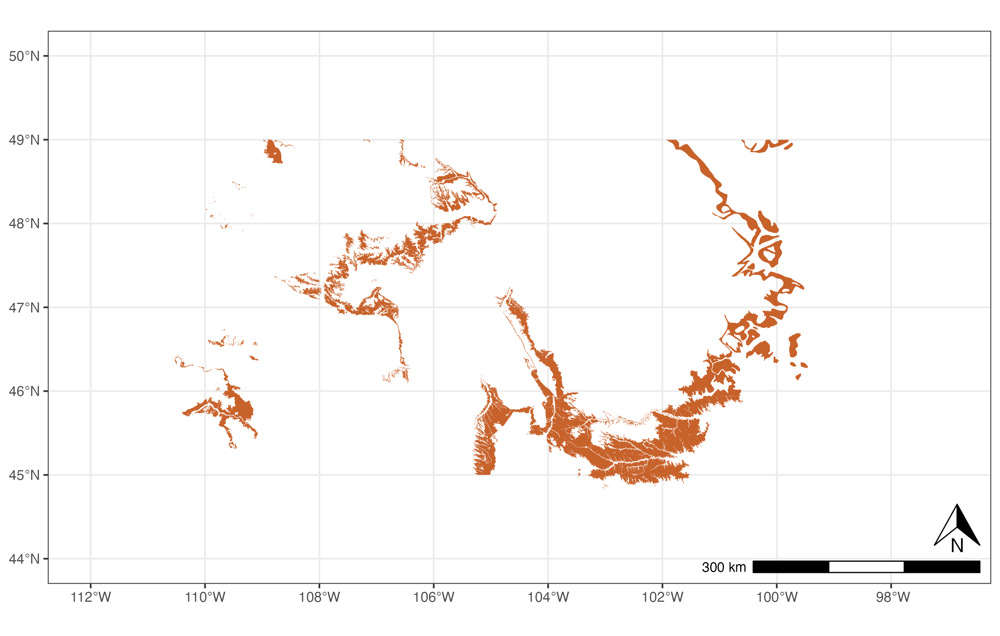
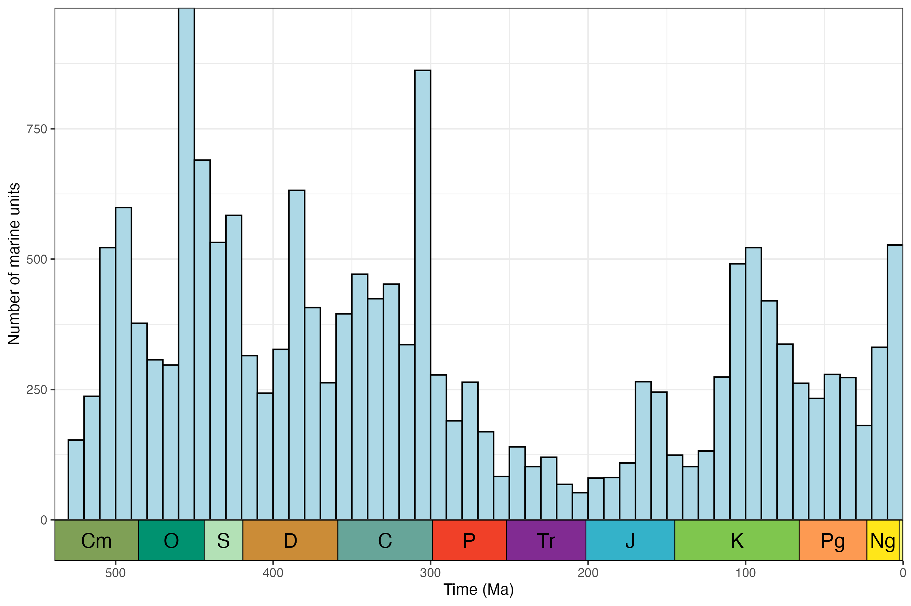

# rmacrostrat

<!-- badges: start -->
[](https://github.com/palaeoverse/rmacrostrat/actions/workflows/R-CMD-check.yaml)
[](https://app.codecov.io/gh/palaeoverse/rmacrostrat?branch=main)
[](https://twitter.com/ThePalaeoverse)
<!-- badges: end -->

The goal of `rmacrostrat` is to streamline and improve accessibility to the geological database [Macrostrat](https://macrostrat.org). The package provides functionality for querying the database via the dedicated application programming interface (API) and retrieving various geological data (e.g., lithostratigraphic units) and definitions/metadata associated with those data and Macrostrat more broadly.

## Development team
- [Lewis A. Jones](mailto:LewisAlan.Jones@uvigo.es), Universidade de Vigo
- [William Gearty](mailto:willgearty@gmail.com), American Museum of Natural History
- [Christopher D. Dean](mailto:christopherdaviddean@gmail.com), University College London
- [Bethany J. Allen](mailto:Bethany.Allen@bsse.ethz.ch), ETH Zürich

## Installation

The stable version of `rmacrostrat` can be installed from CRAN using:

```r
install.packages("rmacrostrat")
```

You can install the development version of `rmacrostrat` from [GitHub](https://github.com/) with:

``` r
# install.packages("devtools")
devtools::install_github("palaeoverse/rmacrostrat")
```

## Example usage

A minimal example of getting and plotting a stratigraphic column for the San Juan Basin:

```r
# Load packages
library(rmacrostrat)
library(ggplot2)
library(ggrepel)
library(deeptime)
# Get the column definition of the San Juan Basin
column_def <- def_columns(column_name = "San Juan Basin")
# Using the column ID, retrieve all units of Cretaceous age
san_juan_units <- get_units(column_id = column_def$col_id,
                            interval_name = "Cretaceous")
# Specify x_min and x_max in dataframe
san_juan_units$x_min <- 0
san_juan_units$x_max <- 1
# Tweak values for overlapping units
san_juan_units$x_max[10] <- 0.5
san_juan_units$x_min[11] <- 0.5
# Add midpoint age for plotting
san_juan_units$m_age <- (san_juan_units$b_age + san_juan_units$t_age) / 2
# Plot stratigraphic column
ggplot(san_juan_units, aes(ymin = b_age, ymax = t_age,
                           xmin = x_min, xmax = x_max)) +
  # Plot units, colored by rock type
  geom_rect(fill = san_juan_units$color, color = "black") +
  # Add text labels
  geom_text_repel(aes(x = x_max, y = m_age, label = unit_name),
                  size = 3.5, nudge_x = 1.5) +
  # Reverse direction of y-axis
  scale_y_reverse(limits = c(145, 66), n.breaks = 10, name = "Time (Ma)") +
  # Theming
  theme_classic() +
  theme(legend.position = "none",
        axis.line.x = element_blank(),
        axis.title.x = element_blank(),
        axis.text.x = element_blank(),
        axis.ticks.x = element_blank()) +
  # Add geological time scale
  coord_geo(pos = "left", dat = list("stages"), rot = 90)
```
<center></center>

A minimal example of getting and plotting outcrop data for the Hell Creek formation:

```r
# Load libraries
library(rmacrostrat)
library(ggplot2)
library(sf)
# Get data for the chosen formation
hc_def <- def_strat_names(strat_name = "Hell Creek", rank = "Fm")
# Get spatial outcrop data for the formation
hc <- get_map_outcrop(strat_name_id = hc_def$strat_name_id, sf = TRUE)
# Plot the map
ggplot() +
  geom_sf(data = hc, fill = "#C7622B", lwd = 0) +
  coord_sf(xlim = c(-112, -97), ylim = c(44, 50)) +
  theme_bw()
```


A minimal example of getting and plotting the number of marine units through time for North America:

```r
# Load libraries
library(rmacrostrat)
library(ggplot2)
library(deeptime)
# Get all carbonate units for North America
units <- get_units(environ_class = "marine",
                   interval_name = "Phanerozoic",
                   project_id = 1)
# Add mid age for units
units$mid_age <- (units$b_age + units$t_age) / 2
# Plot data
ggplot(units, aes(x = mid_age)) +
  geom_histogram(binwidth = 10, center = 5,
                 color = "black", fill = "#add8e6") +
  scale_y_continuous("Number of marine units") +
  scale_x_reverse("Time (Ma)", limits = c(538.8, 0)) +
  theme_bw() +
  theme(legend.title = element_blank(),
        legend.position.inside = c(0.1, 0.9)) +
  coord_geo()
```


Extensive example usage of `rmacrostrat` is provided in the package vignettes/tutorials. These can be accessed [online](https://rmacrostrat.palaeoverse.org/articles/) or in R via:

```r
browseVignettes(package = "rmacrostrat")
```

# How to contribute?
If you are interested in contributing to the `rmacrostrat` R package, you can do so by following these [guidelines](https://rmacrostrat.palaeoverse.org/CONTRIBUTING.html). We have also adopted a set of [standards and structure](https://palaeoverse.palaeoverse.org/articles/structure-and-standards.html) to broadly follow for contributing to Palaeoverse R packages. If you would like to contribute to `rmacrostrat`, we strongly advise reading this document.

# Code of Conduct

As with any community project, society, or meeting we feel it is important to established some expectations of behaviour in the `rmacrostrat` community. Please read our [code of conduct](https://rmacrostrat.palaeoverse.org/CODE_OF_CONDUCT.html), and reach out if you ever face any issues. Everyone has the right to live and work in a harassment-free environment.

# Citation

If you use the `rmacrostrat` R package in your work, please cite as:

Jones, L.A., Dean, C.D., Gearty, W., and Allen, B.J. 2024. rmacrostrat: An R package for accessing and retrieving data from the Macrostrat geological database. EarthArXiv. doi: [10.31223/X5XX37](https://doi.org/10.31223/X5XX37).

<p align="left">


</p>

<p align="left"; style="font-size:11px">Hexlogo by Miranta Kouvari</p>

