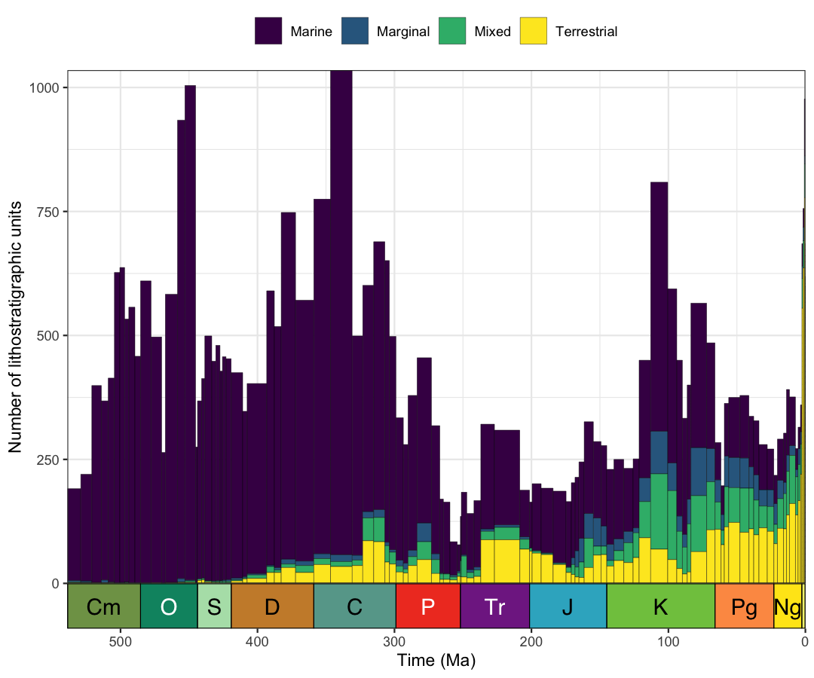
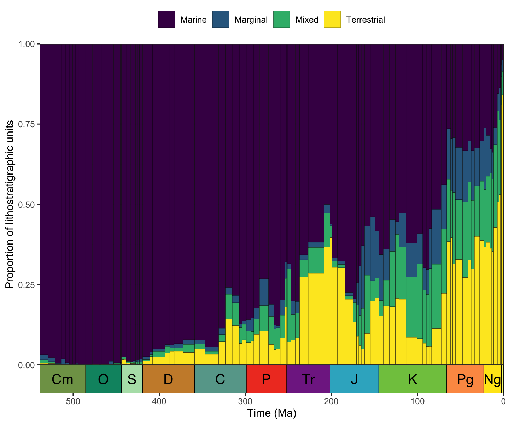

**Authors:** [Palaeoverse Development Team](https://palaeoverse.org/#about-us)

**Last updated:** 2024-09-16


<div style="text-align: justify">

# Introduction

`rmacrostrat` is an R package which allows users to easily retrieve geological data from the [Macrostrat](https://macrostrat.org) database and facilitates analyses of these data within the R environment. This vignette (or tutorial, if you prefer) is provided to guide you through the installation process and some of the functionality available within `rmacrostrat`. Specifically, we will focus on reproducing a classical figure (i.e., Fig. 14) from [Peters & Heim (2010)](https://www.jstor.org/stable/25609444), which visualizes the changing number--and proportion--of sedimentary lithostratigraphic units from different paleoenvironments throughout the Phanerozoic. Let's get started!

# Installation

The `rmacrostrat` package can be installed via CRAN, or its dedicated [GitHub repository](https://github.com/palaeoverse/rmacrostrat) if the development version is preferred. To install via CRAN, simply use:


``` r
install.packages("rmacrostrat")
```

To install the development version, first install the `devtools` package, and then use `install_github` to install `rmacrostrat` directly from GitHub.


``` r
install.packages("devtools")
devtools::install_github("palaeoverse/rmacrostrat")
```

You can now load `rmacrostrat` using the standard `library` function:


``` r
library(rmacrostrat)
```

**Before we get into the good stuff, the development team has a small request**. If you use `rmacrostrat` in your research, please cite the associated publication. This will help us to continue our work in supporting you to do yours. You can access the appropriate citation via:


``` r
citation("rmacrostrat")
```

```
## To cite rmacrostrat in publications, use the following citation:
## 
##   Jones, L.A., Dean, C.D., Gearty, W., and Allen, B.J. 2024. rmacrostrat: An R package for
##   accessing and retrieving data from the Macrostrat geological database. EarthArXiv, 1–29,
##   doi: 10.31223/X5XX37
## 
## A BibTeX entry for LaTeX users is
## 
##   @Article{,
##     title = {rmacrostrat: An R Package for fetching geologic data from the Macrostrat database.},
##     author = {Lewis A. Jones and Christopher D. Dean and William Gearty and Bethany J. Allen},
##     year = {2024},
##     journal = {EarthArXiv},
##     pages = {1–29},
##     doi = {10.31223/X5XX37},
##   }
```

# Context

Quantifying the spatiotemporal distribution of sedimentary lithostratigraphic units is fundamental to understanding how environments, and the biodiversity within them, have evolved throughout Earth's history. Previous work by [Peters & Heim (2010)](https://www.jstor.org/stable/25609444) focused on *"the geological completeness of paleontological sampling in North America"*, with the aim of recognizing and overcoming geologically-controlled sampling biases. One component of this article involved quantifying how the number and proportion of lithostratigraphic units preserving different paleoenvironment types (e.g., marine, marginal, terrestrial) varies through time. In this vignette, we will revisit this question and examine how the number and proportion of different sedimentary lithostratigraphic units--grouped by paleoenvironment type--changes over the Phanerozoic. To do so, we will make use of the `rmacrostrat` package to fetch data from the [Macrostrat](https://macrostrat.org) database.

# Retrieving data

To quantify how the number and proportion of different lithostratigraphic units change through time, we will focus on the following paleoenvironmental groupings: marine, marginal, and terrestrial. The first step in establishing these groupings is to see what different environments are actually available in [Macrostrat](https://macrostrat.org):

*Hint: Remember that all definitions of data stored in [Macrostrat](https://macrostrat.org) are available via the `def_` suite of functions.*


``` r
# What environments are available?
# Hint: Defining no arguments returns all environments
environments <- def_environments()
# See the first few rows
head(environments)
```

```
##   environ_id                                 name      type  class   color t_units
## 1          1                            peritidal carbonate marine #B8B8E6      94
## 2          2                     shallow subtidal carbonate marine #3399FF     815
## 3          3                open shallow subtidal carbonate marine #3399FF     421
## 4          4 lagoonal/restricted shallow subtidal carbonate marine #B8B8E6     216
## 5          5                           sand shoal carbonate marine #5CADFF      25
## 6          6                                 reef carbonate marine #33CCFF     156
```

From this call, we can see a whole suite of different inferred paleoenvironments are available, which are conveniently grouped into a type (e.g., carbonate, fluvial, lacustrine) and class (i.e., marine and non-marine). Class seems helpful for discerning between marine and non-marine environments, but we also want a marginal category, so we need to re-classify some of these environment definitions.

We can define which paleoenvironments are marginal using the additional information available in the `name` column of `environments`. For this definition, let's consider that any environment that is classified as a delta, beach, barrier island, estuary, lagoon, or tidal flat is a marginal environment. From our available environments (*n* = 87), we can identify 22 as marginal environments. This classification is perhaps a little subjective, but for this vignette it provides a fair representation of marginal environments:


``` r
# Define an object classifying marginal paleoenvironments
marginal_envs <- c("shallow subtidal", "open shallow subtidal",
                   "lagoonal/restricted shallow subtidal", "paralic indet.",
                   "lagoonal", "coastal indet.", "foreshore", "shoreface",
                   "transition zone/lower shoreface", "barrier bar",
                   "deltaic indet.", "delta plain", "interdistributary bay",
                   "delta front", "prodelta", "marginal marine",
                   "deltaic indet.", "delta plain", "lacustrine deltaic indet.",
                   "lacustrine delta plain", "lacustrine prodelta", "playa")
```

Now that we've defined our marginal paleoenvironments, we can re-classify the `class` column in `environments` so that we have three categories. We can also replace the label "non-marine" with "terrestrial" for clarity:


``` r
# Update class to include marginal
environments$class[which(environments$name %in% marginal_envs)] <- "marginal"
# Change the name of non-marine class to terrestrial
environments$class[which(environments$class == "non-marine")] <- "terrestrial"
```

For simplicity, we will create three separate `data.frame`s, one for each paleoenvironment.


``` r
# Subset dataframe
marine <- subset(environments, class == "marine")
marginal <- subset(environments, class == "marginal")
terrestrial <- subset(environments, class == "terrestrial")
```

Great! So we now have our groupings, but if we want to investigate how lithostratigraphic units change through time, we need a little more information. Specifically, we need to know the inferred paleoenvironment and age of each lithostratigraphic unit. We can retrieve such information about lithostratigraphic units using the `get_units` function. Conveniently, we can request such data for each paleoenvironmental class using the `environ_id` column.

*Hint: Remember that to retrieve data stored in [Macrostrat](https://macrostrat.org) (e.g., Macrostrat columns, sections, and units), the `get_` suite of functions must be used.*


``` r
# Retrieve marine units
marine_units <- get_units(environ_id = marine$environ_id)
# Retrieve marginal units
marginal_units <- get_units(environ_id = marginal$environ_id)
# Retrieve terrestrial units
terrestrial_units <- get_units(environ_id = terrestrial$environ_id)
# Let's also add the environment class in these dataframes for consistency
marine_units$environ_class <- "Marine"
marginal_units$environ_class <- "Marginal"
terrestrial_units$environ_class <- "Terrestrial"
```

Nice! That was pretty straightforward. However, some `unit_id` values in the `marine` dataframe are also present in the marginal and terrestrial dataframes, and vice versa:


``` r
# How many marine unit IDs are also in terrestrial?
length(which(marine_units$unit_id %in% terrestrial_units$unit_id))
```

```
## [1] 499
```

On further investigation, we can see that some lithostratigraphic units are associated with multiple different paleoenvironments (various combinations of marine, marginal, and terrestrial). Interesting, but perhaps to be expected given transgression and regression cycles! We should treat these differently to our pre-existing groupings for clarity. Let's make a new paleoenvironment class called "mixed", and update the environment class accordingly.


``` r
# Which unit IDs are shared between several paleoenvironments?
shared_id <- c(
  # Marine
  marine_units$unit_id[which(marine_units$unit_id %in% terrestrial_units$unit_id)],
  marine_units$unit_id[which(marine_units$unit_id %in% marginal_units$unit_id)],
  # Marginal
  marginal_units$unit_id[which(marginal_units$unit_id %in% marine_units$unit_id)],
  marginal_units$unit_id[which(marginal_units$unit_id %in% terrestrial_units$unit_id)],
  # Terrestrial
  terrestrial_units$unit_id[which(terrestrial_units$unit_id %in% marine_units$unit_id)],
  terrestrial_units$unit_id[which(terrestrial_units$unit_id %in% marginal_units$unit_id)]
)
# Get unique IDs
shared_id <- unique(shared_id)
# Combine dataframes
litho_units <- rbind.data.frame(marine_units, marginal_units, terrestrial_units)
# Recode environment class
litho_units$environ_class[which(litho_units$unit_id %in% shared_id)] <- "Mixed"
# Retain only unique units
litho_units <- unique(litho_units)
```

Great, we can now see that we don't have any duplicate units in our dataset anymore:


``` r
# Check if any units appear more than once
any(table(litho_units$unit_id) > 1)
```

```
## [1] FALSE
```

OK - we now have four lithostratigraphic groupings for our units, but Figure 14 from [Peters & Heim (2010)](https://www.jstor.org/stable/25609444) includes a fifth unit group, "unknown". For the sake of completeness, let's get all sedimentary lithostratigraphic units not already covered by our other four groupings (marine, marginal, mixed, and terrestrial). As we cannot search [Macrostrat](https://macrostrat.org) by "unknown", we will first pull all Phanerozoic sedimentary units, and then filter out units already present in our `litho_units` dataset.


``` r
# Get all Phanerozoic units
all_units <- get_units(interval_name = "Phanerozoic", lithology_class = "sedimentary")
# Remove units not already present in litho_units (unknown palaeoenvironments)
unknown_units <- subset(all_units, !unit_id %in% litho_units$unit_id)
# Check data
head(unknown_units$environ)
```

```
## list()
```

Wow, updates to Macrostrat have led to no sedimentary units having an "unknown" paleoenvironment - great! But we've just remembered that [Macrostrat](https://macrostrat.org) doesn't only cover North America, and we've pulled all units available worldwide. To make a closer reproduction of Figure 14 from [Peters & Heim (2010)](https://www.jstor.org/stable/25609444), we ought to just focus on North America. Conveniently, [Macrostrat](https://macrostrat.org) is split into different projects, which tend to cover different regions:


``` r
# Check available projects
def_projects()[, 1:2]
```

```
##    project_id                   project
## 1           1             North America
## 2           3                      eODP
## 3           4                  Deep Sea
## 4           5               New Zealand
## 5           6                 Australia
## 6           7                 Caribbean
## 7           8             South America
## 8           9                    Africa
## 9          10  North American Ediacaran
## 10         11 North American Cretaceous
## 11         12                 Indonesia
## 12         13          Northern Eurasia
```

From this call, we can see that North America has a `project_id` of 1. We can use this information to further filter `litho_units`:


``` r
# Filter to N. America
litho_units <- subset(litho_units, project_id == 1)
```

Now we've got our data and done a bit of wrangling, let's get on with summarizing and visualizing it.

# Summarizing data

We are interested in how the number and proportion of lithostratigraphic units representing different paleoenvironment classes changes through time. Conveniently, lithostratigraphic units in [Macrostrat](https://macrostrat.org) have age information associated with them, specifically the minimum (`t_age`) and maximum (`b_age`) age in millions of years before present. Using this data, with some handy support functions from the `palaeoverse` R package, we can count the number of lithographic units within each paleoenvironmental group, and within each time bin. We will use international stratigraphic stage bins as our time bins for this:


``` r
# Load palaeoverse R package
library(palaeoverse)
# Generate stage-level time bins
bins <- time_bins(scale = "international ages")
# Rename age columns in litho_units to be consistent with bins
colnames(litho_units)[which(colnames(litho_units) == "b_age")] <- "max_ma"
colnames(litho_units)[which(colnames(litho_units) == "t_age")] <- "min_ma"
# As we are only interested in the Phanerozoic, let's remove any
# units that have a minimum age of more than 538.8 Ma
litho_units <- subset(litho_units, min_ma <= 538.8)
# In case the maximum age of units exceeds 538.8, but the minimum
# age is less than 538.8, let's set max_ma to 538.8 to still count it
# if it appears at any point in the Fortunian
litho_units$max_ma[which(litho_units$max_ma > 538.8)] <- 538.8
# Bin data using the bin_time function with the "all"
# method. This will place units into all bins the unit
# overlaps with, generating additional rows for each time
# bin covered (expect an increase in the number of rows)
litho_units <- bin_time(occdf = litho_units,
                        bins = bins,
                        min_ma = "min_ma",
                        max_ma = "max_ma",
                        method = "all")
# Calculate the number of environment classes per time bin
# Remember, each row is a unique instance of a unit within a bin
counts <- group_apply(occdf = litho_units,
                      group = c("environ_class", "bin_assignment"),
                      fun = nrow)
# Rename columns to ease reading and merging
colnames(counts) <- c("count", "environment", "bin")
# Merge datasets to combine time bin information with counts
counts <- merge(x = bins, y = counts, by = "bin")
```

# Visualizing data

Now we have our summary of the lithostratigraphic units, we can visualize this data. First, we will plot the number of units within each paleoenvironment group through time. To support this data visualization, we will make use of the `ggplot2` (plotting) and `deeptime` (adding a geological timescale axis) R packages.


``` r
# Load data visualization packages
library(ggplot2)
library(deeptime)

# Let's first set our factor levels to replicate the original figure
counts$environment <- factor(counts$environment, levels = c("Marine", "Marginal",
                                                            "Mixed", "Terrestrial"))

# Generate a plot of raw counts of lithostratigraphic units through time
# grouped by paleoenvironment
ggplot(counts, aes(fill = environment, y = count, x = mid_ma)) +
  # Stacked bar chart with bar width specified by interval duration
  geom_bar(position = "stack", stat = "identity", width = counts$duration_myr,
           color = "black", linewidth = 0.1) +
  # Label y-axis
  scale_y_continuous("Number of lithostratigraphic units") +
  # Label x-axis and reverse direction
  scale_x_reverse("Time (Ma)") +
  # Data plotting colors
  scale_fill_viridis_d() +
  # Theming
  theme_bw() +
  theme(legend.title = element_blank(),
        legend.position = "top") +
  # Add geological timescale
  coord_geo()
```

<div class="figure">

<p class="caption">plot of chunk visualize_counts</p>
</div>

We can also plot the proportion of units within each paleoenvironment group through time.


``` r
# Generate a plot of lithostratigraphic units through time grouped by
# paleoenvironment as proportions
ggplot(counts, aes(fill = environment, y = count, x = mid_ma)) +
  # Proportional bar chart with bar width specified by interval duration
  geom_bar(position = "fill", stat = "identity", width = counts$duration_myr,
           color = "black", linewidth = 0.1) +
  # Label y-axis
  scale_y_continuous("Proportion of lithostratigraphic units") +
  # Label x-axis and reverse direction
  scale_x_reverse("Time (Ma)") +
  # Data plotting colors
  scale_fill_viridis_d() +
  # Theming
  theme_bw() +
  theme(legend.title = element_blank(),
        legend.position = "top") +
  # Add geological timescale
  coord_geo()
```

<div class="figure">

<p class="caption">plot of chunk visualize_proportions</p>
</div>

And that's it! Not too bad, right? There are some clear differences between our generated plots and those from the original [Peters & Heim (2010)](https://www.jstor.org/stable/25609444) paper (Fig. 14), which is to be expected given that substantially more data is now available in [Macrostrat](https://macrostrat.org) (e.g., no "unknown" paleoenvironments), and there may be differences in what we defined as "marginal" environments. Despite these differences, some broad-scale patterns are largely consistent, such as the higher proportion of terrestrial lithostratigraphic units in the Mesozoic and Cenozoic, compared to the Paleozoic.

Hopefully this vignette has shown you some potential uses for `rmacrostrat` functions and helped provide a workflow for your own analyses. If you have any questions about the package or its functionality, please feel free to join our [Palaeoverse Google group](https://groups.google.com/g/palaeoverse) and leave a comment; we'll aim to answer it as soon as possible!

If you're interested in learning more about `rmacrostrat`, don't forget to check out our other vignettes! You can see which ones are available by calling `vignette(package = "rmacrostrat")`.

# References

Gearty, W. 2024. deeptime: Plotting Tools for Anyone Working in Deep Time. R package version 1.1.1, <https://CRAN.R-project.org/package=deeptime>.

Jones, L.A., Gearty, W., Allen, B.J., Eichenseer, K., Dean, C.D., Galván S., Kouvari, M., Godoy, P.L., Nicholl, C.S.C., Dillon, E.M., Flannery-Sutherland, J.T., Chiarenza, A.A. 2022. palaeoverse: A community-driven R package to support palaeobiological analysis. *Methods in Ecology and Evolution*, 14(9), 2205--2215. doi: 10.1111/2041-210X.14099.

Peters, S.E. and Heim, N.A. 2010. The Geological Completeness of Paleontological Sampling in North America. *Paleobiology* 36(10), pp61--79.

Wickham, H. 2016. ggplot2: Elegant Graphics for Data Analysis. *Springer-Verlag New York*.

</div>

<style type="text/css">
p.caption {
  display: none;
}
</style>
