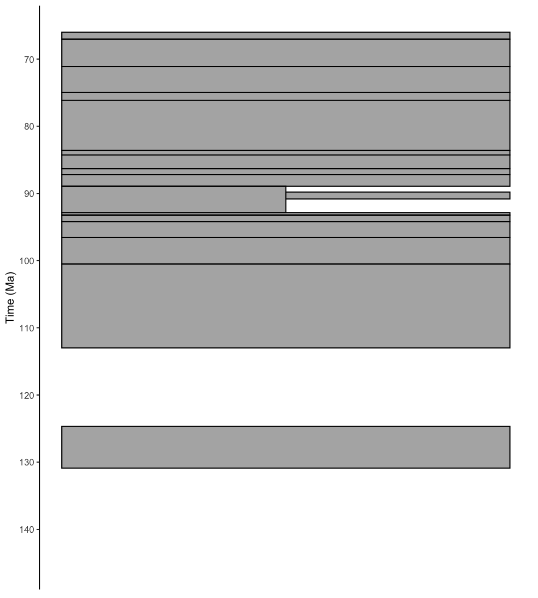
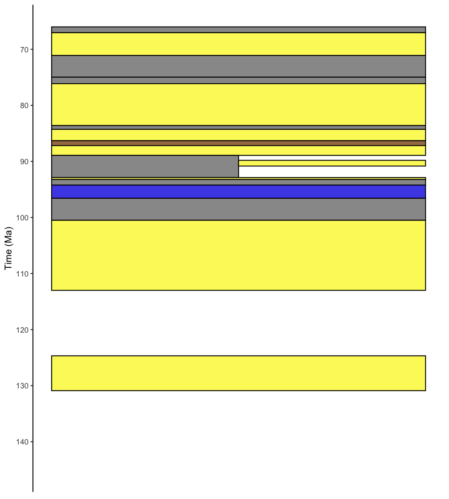

**Authors:** [Palaeoverse Development Team](https://palaeoverse.org/#about-us)

**Last updated:** 2024-09-16


<div style="text-align: justify">

# Introduction

`rmacrostrat` is an R package which allows users to easily retrieve geological data from the [Macrostrat](https://macrostrat.org) database and facilitates analyses of these data within the R environment. This vignette (or tutorial, if you prefer) is provided to guide you through the installation process and some of the functionality available within `rmacrostrat`. Specifically, we will focus on obtaining and plotting a geologic column, containing stratigraphic and lithological information for the San Juan Basin, located in the southwestern United States.

# Installation

The `rmacrostrat` package can be installed via CRAN, or its dedicated [GitHub repository](https://github.com/palaeoverse/rmacrostrat) if the development version is preferred. To install via CRAN, simply use:


``` r
install.packages("rmacrostrat")
```

To install the development version, first install the `devtools` package, and then use `install_github` to install `rmacrostrat` directly from GitHub.


``` r
install.packages("devtools")
devtools::install_github("palaeoverse/rmacrostrat")
```

You can now load `rmacrostrat` using the default `library` function, alongside some packages we will need for plotting, namely `ggplot2`, `ggrepel`, and `deeptime` (don't forget to install these packages if you don't have them already!):


``` r
library(rmacrostrat)
# Install and load data visualization packages
library(ggplot2)
library(ggrepel)
library(deeptime)
```

**Before we get into the good stuff, the development team has a small request**. If you use `rmacrostrat` in your research, please cite the associated publication. This will help us to continue our work in supporting you to do yours. You can access the appropriate citation via:


``` r
citation("rmacrostrat")
```

```
## To cite rmacrostrat in publications, use the following citation:
## 
##   Jones, L.A., Dean, C.D., Gearty, W., and Allen, B.J. 2024. rmacrostrat: An R package for
##   accessing and retrieving data from the Macrostrat geological database. EarthArXiv, 1–29,
##   doi: 10.31223/X5XX37
## 
## A BibTeX entry for LaTeX users is
## 
##   @Article{,
##     title = {rmacrostrat: An R Package for fetching geologic data from the Macrostrat database.},
##     author = {Lewis A. Jones and Christopher D. Dean and William Gearty and Bethany J. Allen},
##     year = {2024},
##     journal = {EarthArXiv},
##     pages = {1–29},
##     doi = {10.31223/X5XX37},
##   }
```

# Context

The San Juan Basin is a large structural depression which spans parts of New Mexico, Colorado, Utah, and Arizona. It is renowned for its oil and natural gas reserves, but it is also well-known for its late Cretaceous dinosaurs. In this vignette, we will investigate the geologic attributes of the rocks of the San Juan Basin and use this information to plot a stratigraphic column. In order to do this, we will make use of the `rmacrostrat` package to fetch data from the [Macrostrat](https://macrostrat.org) database.

# Retrieving data

Our first step is to search for geologic columns named "San Juan Basin" and retrieve some basic information about them, using the `def_columns` function:


``` r
# Get column definitions for the San Juan Basin
def_columns(column_name = "San Juan Basin")
```

```
##   col_id col_group_id       col_name    lat      lng col_area max_thick ref_id status t_units
## 1    489            3 San Juan Basin 35.896 -108.068 35096.52      8040      1 active      47
##   project_id notes
## 1          1    NA
```

From this call, we can see there is a single column named "San Juan Basin". We are also given some information about this column, such as its geographic location (in the form of a latitude and longitude), the area over which it spans in km^2^, its thickness in meters, and the number of geologic units it contains (`t_units`). We are also given its `col_id`, 489, which we can use to retrieve more information through other functions in `rmacrostrat`. We will do this now, specifically using `get_columns`:


``` r
# Using the column ID, retrieve the San Juan Basin column
san_juan <- get_columns(column_id = 489)
```

# Exploring data

We now have much more information relating to the San Juan Basin column. For example, we can look at the age range it spans:


``` r
# Print (numerical) age range of San Juan Basin column
san_juan$b_age
```

```
## [1] 2050
```

``` r
san_juan$t_age
```

```
## [1] 32.38
```

``` r
# Print (interval) age range of the San Juan Basin column
san_juan$b_int_name
```

```
## [1] "Orosirian"
```

``` r
san_juan$t_int_name
```

```
## [1] "Rupelian"
```

We can see that our column spans from 2050 to 32 million years ago, from the Orosirian (Paleoproterozoic) to the Rupelian (Cenozoic).
Let's take a look at the mix of lithologies contained in the column:


``` r
# Print the lithologies contained in the San Juan Basin column
san_juan$lith
```

```
## [[1]]
##              name            type       class   prop lith_id
## 1       claystone   siliciclastic sedimentary 0.0015       6
## 2           shale   siliciclastic sedimentary 0.2867       8
## 3       siltstone   siliciclastic sedimentary 0.0340       9
## 4       sandstone   siliciclastic sedimentary 0.2773      10
## 5          arkose   siliciclastic sedimentary 0.0177      11
## 6    conglomerate   siliciclastic sedimentary 0.0606      14
## 7       limestone       carbonate sedimentary 0.0771      30
## 8        dolomite       carbonate sedimentary 0.0832      31
## 9       evaporite       evaporite sedimentary 0.0019      34
## 10         gypsum       evaporite sedimentary 0.0030      36
## 11      anhydrite       evaporite sedimentary 0.0030      37
## 12           coal         organic sedimentary 0.0039      38
## 13        granite        plutonic     igneous 0.0177      53
## 14         gneiss     metamorphic metamorphic 0.0106      79
## 15          slate metasedimentary metamorphic 0.0071      82
## 16       phyllite metasedimentary metamorphic 0.0071      83
## 17      quartzite metasedimentary metamorphic 0.0147      85
## 18           clay   siliciclastic sedimentary 0.0030      93
## 19      graywacke   siliciclastic sedimentary 0.0213     113
## 20        arenite   siliciclastic sedimentary 0.0097     134
## 21   syenogranite        plutonic     igneous 0.0035     145
## 22 quartz arenite   siliciclastic sedimentary 0.0213     169
## 23   metavolcanic     metaigneous metamorphic 0.0106     178
## 24          wacke   siliciclastic sedimentary 0.0019     187
## 25    litharenite   siliciclastic sedimentary 0.0213     198
```

So our column contains a total of 25 different lithologies, including sedimentary, metamorphic, and igneous rocks. We can quickly visualize the proportion of the column made up of these different rocks, colored by their class:


``` r
# Extract lithologies
lith_table <- san_juan$lith[[1]]
# Plot lithologies by proportion in San Juan Basin column
ggplot(lith_table, aes(y = prop, x = reorder(name, -prop))) +
  # Plot bars
  geom_bar(stat = "identity", aes(fill = class)) +
  # Label axes
  scale_x_discrete("Lithology") +
  scale_y_continuous("Proportion of stratigraphic column") +
  theme_classic() +
  theme(axis.text.x = element_text(angle = 90, vjust = 0.5, hjust = 1))
```

<div class="figure">

<p class="caption">plot of chunk lith_plot</p>
</div>

It seems the San Juan Basin is dominated by sedimentary rocks. Perhaps this is not surprising given that we know it is famed for fossils and energy resources!
Speaking of these, let's take a look at the column's economic attributes:


``` r
# Print a summary of economic attributes of the San Juan Basin column
san_juan$econ
```

```
## [[1]]
##            name        type  class   prop econ_id
## 1 oil reservoir hydrocarbon energy 0.0345       4
## 2 gas reservoir hydrocarbon energy 0.0345       5
## 3    gas indet. hydrocarbon energy 0.4138       8
## 4    oil indet. hydrocarbon energy 0.3103       9
## 5   uranium ore     nuclear energy 0.1034      10
## 6          coal        coal energy 0.0690      13
## 7       aquifer     aquifer  water 0.0345      17
```

Here we can see that not only does the San Juan Basin contain coal, oil, and natural gas, but it also has some uranium ore and aquifers.
We can also see the number of [Paleobiology Database](https://paleobiodb.org) collections linked to the San Juan Basin in our column information:


``` r
# Print number of PBDB collections
san_juan$pbdb_collections
```

```
## [1] 646
```

To view more information about these fossil data, we need to use a different `rmacrostrat` function, `get_fossils`: 


``` r
# Retrieve fossils associated with the San Juan Basin column
sj_fossils <- get_fossils(column_id = 489)
```

This table contains information about each of the ~650 [Paleobiology Database](https://paleobiodb.org) collections associated with the San Juan Basin, including their ages and the number of occurrences they contain. Let's find out how many fossil occurrences we have in total:


``` r
# How many fossil occurrences are associated with the San Juan Basin?
sum(sj_fossils$pbdb_occs)
```

```
## [1] 2151
```

So over 2000 fossils are known from this single basin. We can also visualize the temporal distribution of these fossil collections, using the midpoint of their age ranges:


``` r
# Add midpoint age for plotting
sj_fossils$m_age <- (sj_fossils$b_age + sj_fossils$t_age) / 2

# Plot of fossil occurrence counts from the San Juan Basin through time
ggplot(sj_fossils, aes(x = m_age)) + 
  # Histogram with bars 5 million years wide
  geom_histogram(binwidth = 5, boundary = 0) +
  # Label y-axis
  scale_y_continuous("Number of fossil collections") +
  # Label x-axis and reverse direction
  scale_x_reverse("Time (Ma)", breaks = c(250, 200, 150, 100, 50)) +
  # Theming 
  theme_bw() +
  # Add geological timescale
  coord_geo()
```

<div class="figure">

<p class="caption">plot of chunk fossil_plot</p>
</div>

From this plot, we can see that the San Juan Basin fossils range in age from the Permian to the Paleogene, but we have the highest concentration of fossil collections around the K-Pg boundary.
Now that we have explored the data in the [Macrostrat](https://macrostrat.org) database on the San Juan Basin, it is time to plot our stratigraphic column.

# Plotting the stratigraphic column

To plot the stratigraphic column, we will need to obtain data for each lithological unit contained within the San Juan Basin column. We will do this using another `rmacrostrat` function, `get_units`, and referencing the `column_id` for the San Juan Basin. To keep our column plot contained, we will limit it to geological units which are Cretaceous in age:


``` r
# Using the column ID, retrieve the units in the San Juan Basin column
san_juan_units <- get_units(column_id = 489, interval_name = "Cretaceous")
# See the column names and number of rows
colnames(san_juan_units)
```

```
##  [1] "unit_id"          "section_id"       "col_id"           "project_id"       "col_area"        
##  [6] "unit_name"        "strat_name_id"    "Mbr"              "Fm"               "Gp"              
## [11] "SGp"              "t_age"            "b_age"            "max_thick"        "min_thick"       
## [16] "outcrop"          "pbdb_collections" "pbdb_occurrences" "lith"             "environ"         
## [21] "econ"             "measure"          "notes"            "color"            "text_color"      
## [26] "t_int_id"         "t_int_name"       "t_int_age"        "t_prop"           "units_above"     
## [31] "b_int_id"         "b_int_name"       "b_int_age"        "b_prop"           "units_below"     
## [36] "strat_name_long"  "refs"             "clat"             "clng"             "t_plat"          
## [41] "t_plng"           "b_plat"           "b_plng"
```

``` r
nrow(san_juan_units)
```

```
## [1] 17
```

We now have information for each of the 17 Cretaceous geologic units contained within the San Juan Basin, including the age of the top and bottom of each, which is what we will use to plot our stratigraphic column. To reiterate, the y-axis on our plot is going to be time rather than height or thickness, so any unconformities present in the column will be evident. We can start out very simply, by using `geom_rect` in `ggplot2` to plot a rectangle corresponding to the age range of each unit in the section.


``` r
# Plot stratigraphic column
ggplot(san_juan_units, aes(ymin = b_age, ymax = t_age, xmin = 0, xmax = 1)) +
  # Plot units
  geom_rect(alpha = 0.5, color = "black") +
  # Reverse direction of y-axis
  scale_y_reverse(limits = c(145, 66), n.breaks = 10, name = "Time (Ma)") +
  # Theming
  theme_classic() +
  theme(legend.position = "none",
        axis.line.x = element_blank(),
        axis.title.x = element_blank(),
        axis.text.x = element_blank(),
        axis.ticks.x = element_blank())
```

<div class="figure">

<p class="caption">plot of chunk column_a</p>
</div>

We can already see something that roughly resembles a stratigraphic column. One thing to notice here is that we seem to have some overlap between our units, resulting in a darker shade of gray. We can take a closer look at this by dodging the units horizontally.


``` r
# Plot stratigraphic column
ggplot(san_juan_units, aes(ymin = b_age, ymax = t_age, xmin = 0, xmax = 1)) +
  # Plot units with position dodge
  geom_rect(position = "dodge2", alpha = 0.5, color = "black") +
  # Reverse direction of y-axis
  scale_y_reverse(limits = c(145, 66), n.breaks = 10, name = "Time (Ma)") +
  # Theming
  theme_classic() +
  theme(legend.position = "none",
        axis.line.x = element_blank(),
        axis.title.x = element_blank(),
        axis.text.x = element_blank(),
        axis.ticks.x = element_blank())
```

<div class="figure">

<p class="caption">plot of chunk column_b</p>
</div>

Indeed, there are two units that overlap with each other: the Gallup Sandstone and the Upper Shale Member of the Mancos Shale. We can make these units plot next to each other by adding columns to our dataframe which define the x-axis values.


``` r
# Specify x_min and x_max in dataframe
san_juan_units$x_min <- 0
san_juan_units$x_max <- 1
# Tweak values for overlapping units
san_juan_units$x_max[10] <- 0.5
san_juan_units$x_min[11] <- 0.5

# Plot stratigraphic column
ggplot(san_juan_units, aes(ymin = b_age, ymax = t_age,
                           xmin = x_min, xmax = x_max)) +
  # Plot units
  geom_rect(alpha = 0.5, color = "black") +
  # Reverse direction of y-axis
  scale_y_reverse(limits = c(145, 66), n.breaks = 10, name = "Time (Ma)") +
  # Theming
  theme_classic() +
  theme(legend.position = "none",
        axis.line.x = element_blank(),
        axis.title.x = element_blank(),
        axis.text.x = element_blank(),
        axis.ticks.x = element_blank())
```

<div class="figure">

<p class="caption">plot of chunk column_c</p>
</div>

However, there is a lot we can do to improve the aesthetics of our plot. For example, the column named `color` in our dataframe specifies the hexadecimal color corresponding to the dominant lithology of the unit. We can use this to color-code the units by lithology.


``` r
# Plot stratigraphic column
ggplot(san_juan_units, aes(ymin = b_age, ymax = t_age,
                           xmin = x_min, xmax = x_max)) +
  # Plot units, colored by rock type
  geom_rect(fill = san_juan_units$color, color = "black") +
  # Reverse direction of y-axis
  scale_y_reverse(limits = c(145, 66), n.breaks = 10, name = "Time (Ma)") +
  # Theming
  theme_classic() +
  theme(legend.position = "none",
        axis.line.x = element_blank(),
        axis.title.x = element_blank(),
        axis.text.x = element_blank(),
        axis.ticks.x = element_blank())
```

<div class="figure">

<p class="caption">plot of chunk column_d</p>
</div>

Great! Now let's add labels indicating the names of the different units.


``` r
# Add midpoint age for plotting
san_juan_units$m_age <- (san_juan_units$b_age + san_juan_units$t_age) / 2

# Plot stratigraphic column
ggplot(san_juan_units, aes(ymin = b_age, ymax = t_age,
                           xmin = x_min, xmax = x_max)) +
  # Plot units, colored by rock type
  geom_rect(fill = san_juan_units$color, color = "black") +
  # Add text labels
  geom_text_repel(aes(x = x_max, y = m_age, label = unit_name),
                  size = 4, hjust = 0, force = 2,
                  min.segment.length = 0, direction = "y",
                  nudge_x = rep_len(x = c(2, 3), length.out = 17)) +
  # Reverse direction of y-axis
  scale_y_reverse(limits = c(145, 66), n.breaks = 10, name = "Time (Ma)") +
  # Theming
  theme_classic() +
  theme(legend.position = "none",
        axis.line.x = element_blank(),
        axis.title.x = element_blank(),
        axis.text.x = element_blank(),
        axis.ticks.x = element_blank())
```

<div class="figure">

<p class="caption">plot of chunk column_e</p>
</div>

And finally, we can add a column along the y-axis indicating the different stages of the Cretaceous, using the R package `deeptime`:


``` r
# Plot stratigraphic column
ggplot(san_juan_units, aes(ymin = b_age, ymax = t_age,
                           xmin = x_min, xmax = x_max)) +
  # Plot units, colored by rock type
  geom_rect(fill = san_juan_units$color, color = "black") +
  # Add text labels
  geom_text_repel(aes(x = x_max, y = m_age, label = unit_name),
                  size = 3.5, hjust = 0, force = 2,
                  min.segment.length = 0, direction = "y",
                  nudge_x = rep_len(x = c(2, 3), length.out = 17)) +
  # Reverse direction of y-axis
  scale_y_reverse(limits = c(145, 66), n.breaks = 10, name = "Time (Ma)") +
  # Theming
  theme_classic() +
  theme(legend.position = "none",
        axis.line.x = element_blank(),
        axis.title.x = element_blank(),
        axis.text.x = element_blank(),
        axis.ticks.x = element_blank()) +
  # Add geological time scale
  coord_geo(pos = "left", dat = list("stages"), rot = 90)
```

<div class="figure">

<p class="caption">plot of chunk column_f</p>
</div>

Hopefully this vignette has shown you the potential uses for `rmacrostrat` functions and helped provide a workflow for your own analyses. If you have any questions about the package or its functionality, please feel free to join our [Palaeoverse Google group](https://groups.google.com/g/palaeoverse) and leave a question; we'll aim to answer it as soon as possible!

If you're interested in learning more about `rmacrostrat`, don't forget to check out our other vignettes! You can see which ones are available by calling `vignette(package = "rmacrostrat")`.

# References

Gearty, W. 2024. deeptime: Plotting Tools for Anyone Working in Deep Time. R package version 1.1.1, <https://CRAN.R-project.org/package=deeptime>.

Jones, L.A., Gearty, W., Allen, B.J., Eichenseer, K., Dean, C.D., Galván S., Kouvari, M., Godoy, P.L., Nicholl, C.S.C., Dillon, E.M., Flannery-Sutherland, J.T., Chiarenza, A.A. 2022. palaeoverse: A community-driven R package to support palaeobiological analysis. *Methods in Ecology and Evolution*, 14(9), 2205--2215. doi: 10.1111/2041-210X.14099.

Wickham, H. 2016. ggplot2: Elegant Graphics for Data Analysis. *Springer-Verlag New York*.

</div>

<style type="text/css">
p.caption {
  display: none;
}
</style>
